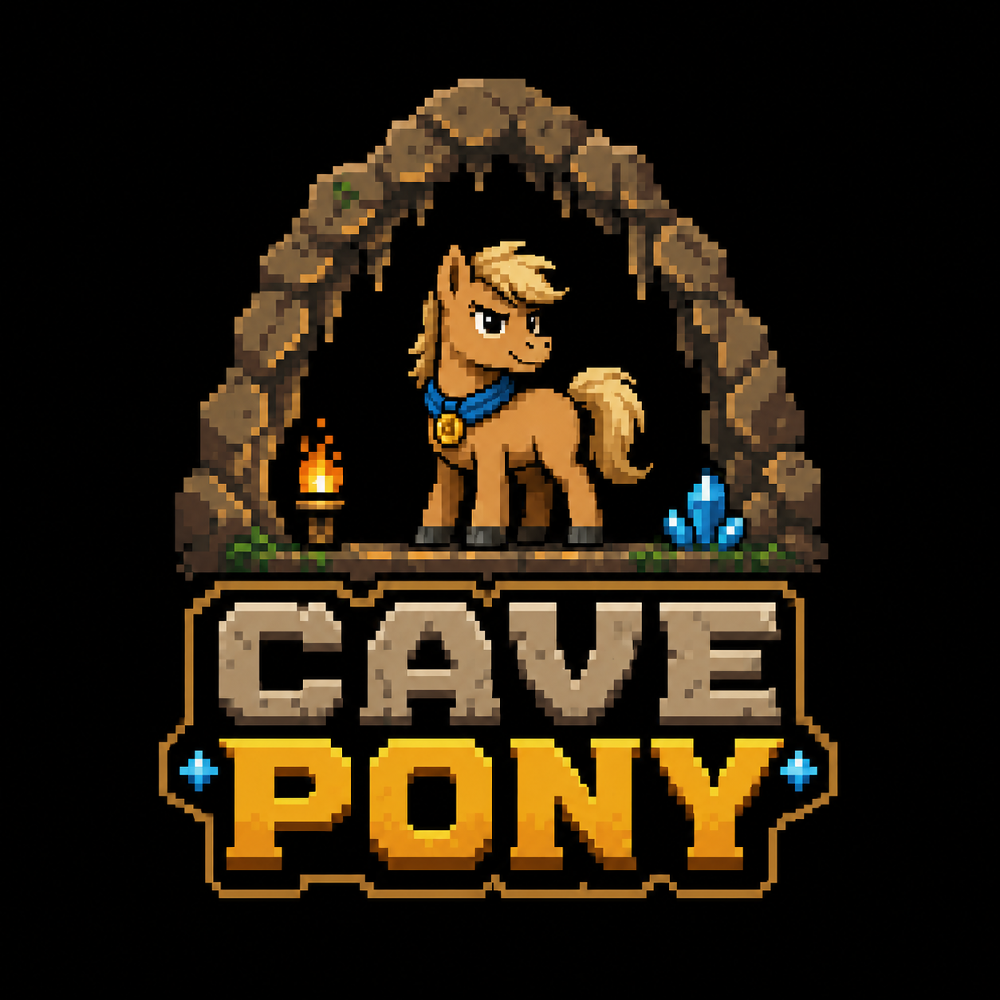

<p align="center">
  
</p>

<h1 align="center">Cave Pony</h1>

<p align="center"><strong>Do less. Say less. Prove enough.</strong></p>

<p align="center">
  <a href="https://github.com/wilfgrainger/cave-pony/actions/workflows/ci.yml"></a>
  <a href="LICENSE"></a>
  
</p>

<p align="center">A coding-agent skill for the <strong>smallest trustworthy change</strong>.</p>

Cave Pony helps an agent inspect the real path, choose the least code that solves the task, and show enough proof to trust the result. It coordinates:

- **Footprint:** own as little new implementation surface as the task allows.
- **Attention:** consume as little human attention as clear communication allows.
- **Assurance:** never shrink away proof, safety, compatibility, or trust-boundary checks required by the risk.

This repository is the canonical home of Cave Pony.

> **Public preview — `0.1.0`.** Installation is verified in the documented project layouts. Independent agent-behavior evidence is still being collected.

## Quick start

Current development version: `0.1.0`.

```bash
npx --yes skills@1.5.9 add https://github.com/wilfgrainger/cave-pony/tree/main/skills/cave-pony
```

The command follows moving `main`; it is for trying the preview. Choose the agent and project or user scope in the installer. For manual installation, upgrade and removal, see [Installation](docs/INSTALLATION.md).

| Host | Explicit invocation after installation |
|---|---|
| Codex CLI or IDE | Select the skill with `/skills`, or type `$cave-pony` in the prompt. |
| ChatGPT | Select `@cave-pony` when distributed as a plugin or available in the skill picker; a local CLI install does not add it to ChatGPT. |
| Claude Code | Type `/cave-pony` in the session. |
| Other compatible hosts | Use that host's skill picker or request Cave Pony by name; the slash syntax is not universal. |

### Full

Ask your agent: **“Use Cave Pony. Fix this bug with the smallest trustworthy change.”** Full is the default. The agent should inspect the affected flow, reuse what exists, run decisive checks, and report the result and material risk.

### Audit

Ask: **“Use Cave Pony audit on the current diff.”** Audit is read-only unless you ask for fixes. Findings should cite the defect, evidence, consequence and smallest correction. It can also say that it found no material issue.

Installation does not prove agent behavior. The [host verification](docs/HOST_VERIFICATION.md) records install evidence and its limits; the [behavior protocol](docs/CODEX_BEHAVIOUR_PROTOCOL.md) is prepared for fresh authenticated sessions.

## Advanced controls

Optional `lite`, `ultra`, `build=ultra voice=lite`, and `stop cave-pony` controls are documented in the [skill](skills/cave-pony/SKILL.md#advanced-controls). Pass them as words with the skill invocation; hosts do not share one command grammar. Cave Pony does not unload another host-managed skill.

## How it works

1. Understand the affected flow, callers, data, configuration, tests, and trust boundaries.
2. Stop at the first correct rung: no change, deletion, reuse, standard library, native platform, installed dependency, then the smallest local implementation.
3. Fix the narrowest shared root cause rather than guarding the same symptom repeatedly.
4. Run the smallest decisive proof, expanded for material risk.
5. Put the result first and report only useful Done, Proof, Skipped, and Risk lines.

YAGNI decides whether work is presently needed. KISS selects the simplest correct design. DRY centralises stable repeated knowledge, not merely similar syntax. Correctness comes first.

The full agent contract is in [`skills/cave-pony/SKILL.md`](skills/cave-pony/SKILL.md).

## Illustrative example

Request: “Add a flexible retry framework for this one HTTP call.” If the existing client already has retries, Cave Pony should configure the idempotent request and verify its limit, rather than add a package and wrapper hierarchy.

```text
Done: Reused the existing retry policy for the idempotent GET.
Proof: Retry-limit test and existing suite pass.
Skipped: New dependency and wrapper; revisit if another client needs shared policy.
Risk: POST requests remain non-retrying by design.
```

This illustrates the contract; it is not an observed benchmark run. [Real field records](#evidence) include their limitations.

## Safety under compression

Commands that delete, overwrite, reset, force-push, drop, revoke, or rotate state trigger explicit prose. Preconditions, ordering, consequences, preservation, and recovery remain visible.

Cave Pony never minimises away:

- trust-boundary validation;
- authentication or authorisation;
- safe secrets handling;
- error handling needed to prevent corruption or data loss;
- accessibility;
- explicit compatibility guarantees;
- legal or operational obligations.

The static contract probes in [`tests/behavioral_cases.json`](tests/behavioral_cases.json) protect these written rules. They do not guarantee that every host model will obey them.

## Why it exists

[Ponytail](https://github.com/DietrichGebert/ponytail) challenges unnecessary implementation. [Caveman](https://github.com/JuliusBrussee/caveman) challenges unnecessary prose.

Using those ideas together is valuable, but two independent instruction sets do not automatically resolve their conflicts:

- terse output can hide missing proof;
- a small diff can be chosen before the affected path is understood;
- destructive or security-sensitive work can become dangerously compressed;
- separate activation rules can conflict;
- stacked instructions consume more context and can drift independently.

Cave Pony provides one independently authored coordination contract for deciding what must be built, how much must be said, and what must be proved.

It is not a fork, official successor, or endorsed project. Its influences, quotations, source snapshots, and licences are recorded in [Third-party notices](THIRD_PARTY_NOTICES.md) and [Origins and differences](docs/ORIGINS_AND_DIFFERENCES.md).

## Evidence

Published real-repository records:

- [Gov Metrics publication diagnostics](field-tests/2026-07-19-gov-metrics-publication-diagnostics.md): one applied use with stated limitations.
- [Cave Pony self-audit: neutral result](field-tests/2026-07-24-cave-pony-self-audit-neutral.md): a case where the core behavioural contract correctly received no change.

These records are not independent-user evidence or universal performance claims.

The public development URL and the documented Claude Code, Codex, Hermes Agent, and OpenClaw project installation layouts have passed clean GitHub-hosted Ubuntu probes using pinned `skills@1.5.9`. Recurring CI retains the exact-commit Codex installation smoke. [Host verification](docs/HOST_VERIFICATION.md) states exactly what this proves and what still requires authenticated host-behaviour exercises.

Cave Pony does **not** publish a comparative numerical claim. Any future numerical comparison requires separately preregistered work with equivalent conditions, correctness and safety gates, raw artefacts, limitations, and losing cases.

Illustrative contract examples are in [Examples](docs/EXAMPLES.md). They are not benchmark results.

## Help validate it

The best way to help Cave Pony reach `v1.0.0` is to use it on one real repository task and publish what actually happened.

1. Install the public preview above.
2. Use Cave Pony on a genuine coding task, or start with audit on an existing change.
3. Record the result using the [field-test template](field-tests/TEMPLATE.md).
4. Contribute the record through [issue #21](https://github.com/wilfgrainger/cave-pony/issues/21) or a pull request.

Neutral and losing cases are explicitly welcome. Cave Pony needs independent real-repository evidence before `v1.0.0`; evidence that it made no difference or made a result worse is useful evidence too.

Authenticated Codex behaviour testing has a reproducible [protocol](docs/CODEX_BEHAVIOUR_PROTOCOL.md) and is part of the independent evidence gate in [issue #21](https://github.com/wilfgrainger/cave-pony/issues/21). Installation compatibility alone is not behavioural support.

The protocol covers six real-task classes, paired baseline and skill runs where feasible, and review that judges correctness and safety before size or verbosity. It has not yet produced an independent result.

## Project status

Cave Pony is usable today but remains a public-preview `0.1.0`.

Repository checks and installation-path evidence are documented. Independent users, authenticated host-behavior evidence, social-preview verification, brand diligence and an immutable release remain open before `v1.0.0`.

See [Release progress](PROGRESS.md), [Launch checklist](docs/LAUNCH_CHECKLIST.md), [FAQ](docs/FAQ.md), and [Security policy](SECURITY.md).

## Development

No runtime package or third-party Python dependency is required. Unix-like local checks use Python 3.10 or newer and `make`; CI uses Python 3.12.

```bash
make validate
make test
```

On Windows without GNU Make, run the same target commands directly in PowerShell:

```powershell
python tools/validate.py
if (-not (Test-Path "tests/test_profile_artwork.py")) { throw "missing tests/test_profile_artwork.py" }
python -m unittest discover -s tests -v
```

```text
skills/cave-pony/SKILL.md       Agent-facing behaviour
assets/cave-pony-logo.png       High-resolution README artwork
assets/                         Project artwork and social preview
field-tests/                    Real-repository records and template
docs/                           Design, origins, evidence, and launch gates
tests/                          Contract and safety probes
tools/validate.py               Small static contract validator
```

Contributions should demonstrate a concrete failure and the smallest evidence-backed correction. See [Contributing](CONTRIBUTING.md).

## Licence and attribution

Cave Pony is released under the [MIT License](LICENSE).

Ponytail and Caveman are MIT-licensed projects whose ideas influenced Cave Pony. Their full licence texts and copyright notices are retained in [`licenses/`](licenses/), with detailed provenance in [Third-party notices](THIRD_PARTY_NOTICES.md).

The Cave Pony name, wording, coordination model, documentation, and original pixel-art logo are independently authored for this project. No affiliation or endorsement is implied.
